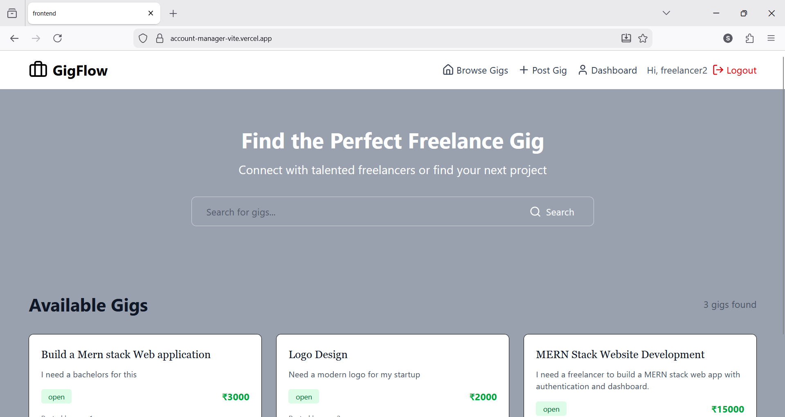

# GigFlow - Freelance Marketplace Platform

A full-stack freelance marketplace where clients can post gigs and freelancers can bid on them.

## 🔗 Live Demo

- **Frontend:** [Vercel URL](https://account-manager-vite.vercel.app/)
- **Backend API:** [Render URL](https://gigflow-qmpm.onrender.com/)

## 🎥 Project Demo (YouTube)

[GigFlow Demo Video](https://youtu.be/vCuG7OR1dqE?si=Zm_OeqQlEcnzAMvU)


## ✨ Features

### Core Features
- ✅ **User Authentication** - Secure JWT-based auth with HttpOnly cookies
- ✅ **Gig Management** - Full CRUD operations for job postings
- ✅ **Search & Filter** - Search gigs by title
- ✅ **Bidding System** - Freelancers can submit bids with message and price
- ✅ **Hiring Workflow** - Atomic hiring logic with status updates

### Bonus Features
- ⭐ **MongoDB Transactions** - Race condition prevention during hiring
- ⭐ **Real-time Notifications** - Socket.io for instant updates when hired
- ⭐ **Responsive Design** - Mobile-friendly UI with Tailwind CSS

### User Roles
- **Client** - Post gigs, review bids, hire freelancers
- **Freelancer** - Browse gigs, submit bids
- **Fluid Roles** - Any user can be both client and freelancer

## 🛠️ Tech Stack

### Frontend
- **Framework:** React 18 with Vite
- **Styling:** Tailwind CSS
- **State Management:** Context API
- **Routing:** React Router v6
- **HTTP Client:** Fetch API
- **Icons:** Lucide React

### Backend
- **Runtime:** Node.js
- **Framework:** Express.js
- **Database:** MongoDB with Mongoose
- **Authentication:** JWT with HttpOnly cookies
- **Real-time:** Socket.io
- **Security:** bcryptjs, cookie-parser, CORS

### Deployment
- **Frontend:** Vercel
- **Backend:** Render
- **Database:** MongoDB Atlas


## 📡 API Endpoints

### Authentication
| Method | Endpoint | Description | Auth Required |
|--------|----------|-------------|---------------|
| POST | `/api/auth/register` | Register new user | No |
| POST | `/api/auth/login` | Login user | No |
| POST | `/api/auth/logout` | Logout user | Yes |
| GET | `/api/auth/me` | Get current user | Yes |

### Gigs
| Method | Endpoint | Description | Auth Required |
|--------|----------|-------------|---------------|
| GET | `/api/gigs` | Get all open gigs (with search) | No |
| GET | `/api/gigs/:id` | Get single gig | No |
| POST | `/api/gigs` | Create new gig | Yes |
| PUT | `/api/gigs/:id` | Update gig | Yes (Owner) |
| DELETE | `/api/gigs/:id` | Delete gig | Yes (Owner) |
| GET | `/api/gigs/my-gigs` | Get user's gigs | Yes |

### Bids
| Method | Endpoint | Description | Auth Required |
|--------|----------|-------------|---------------|
| POST | `/api/bids` | Submit a bid | Yes |
| GET | `/api/bids/:gigId` | Get all bids for a gig | Yes (Gig Owner) |
| GET | `/api/bids/my-bids` | Get user's bids | Yes |
| PATCH | `/api/bids/:bidId/hire` | Hire freelancer (Atomic) | Yes (Gig Owner) |
| DELETE | `/api/bids/:bidId` | Delete bid | Yes (Bid Owner) |

## 🎯 Key Features Explained

### 1. Atomic Hiring Logic ⭐
The hiring process uses MongoDB transactions to ensure data consistency:

```javascript
// When a client hires a freelancer:
1. Gig status: 'open' → 'assigned'
2. Selected bid status: 'pending' → 'hired'
3. All other bids: 'pending' → 'rejected'
```

This happens atomically - either all changes succeed or none do, preventing race conditions.

### 2. Real-time Notifications (Socket.io) ⭐
When a freelancer is hired, they receive an instant notification:
- No page refresh required
- Live dashboard updates


### 3. JWT Authentication with HttpOnly Cookies
- Secure token storage in HttpOnly cookies
- Protected routes on both frontend and backend
- Automatic authentication on page reload

### 4. Context API State Management
Clean, simple state management:
- `AuthContext` - User authentication
- `GigContext` - Gig operations
- `BidContext` - Bid operations


## 🧪 Testing

### Test User Credentials
You can use these test accounts:

**Client:**
- Email: `client@test.com`
- Password: `123456`

**Freelancer:**
- Email: `freelancer@test.com`
- Password: `123456`

### Testing the Hiring Flow
1. Login as client and post a gig
2. Logout and login as freelancer
3. Submit a bid on the gig
4. Login back as client
5. View gig details and see the bid
6. Click "Hire This Freelancer"
7. Observe status changes (gig assigned, bid hired)


## Contributing

This is an assignment project, but feedback and suggestions are welcome!


## 👨‍💻 Author

**Sufal Thakre**
- GitHub: [Sufalthakre18](https://github.com/Sufalthakre18)
- LinkedIn: [Sufal Thakre](https://www.linkedin.com/in/sufal-thakre/)
- Email: sufalthakre4@gmail.com


**Built with ❤️ **

